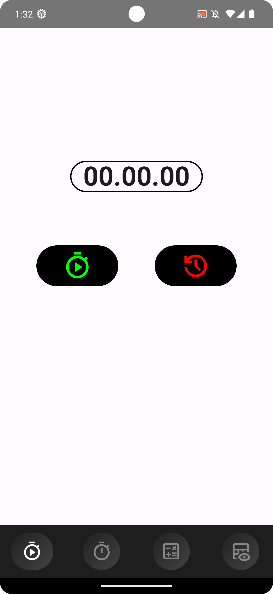
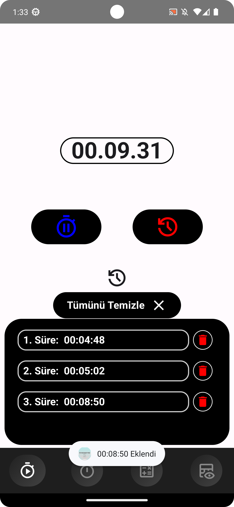
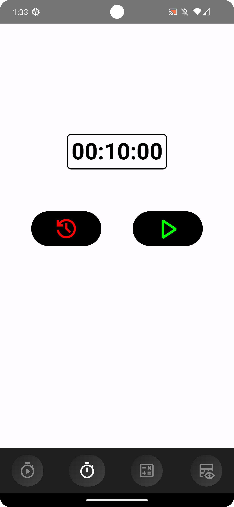
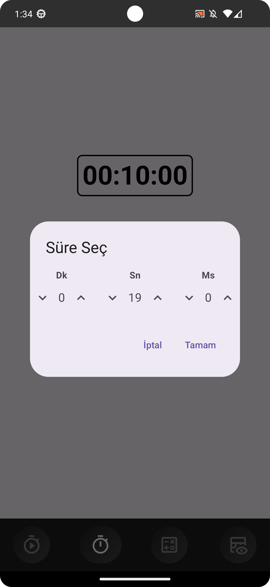
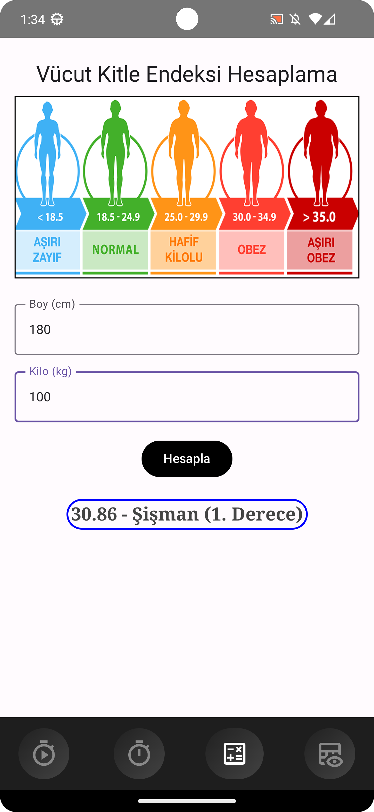
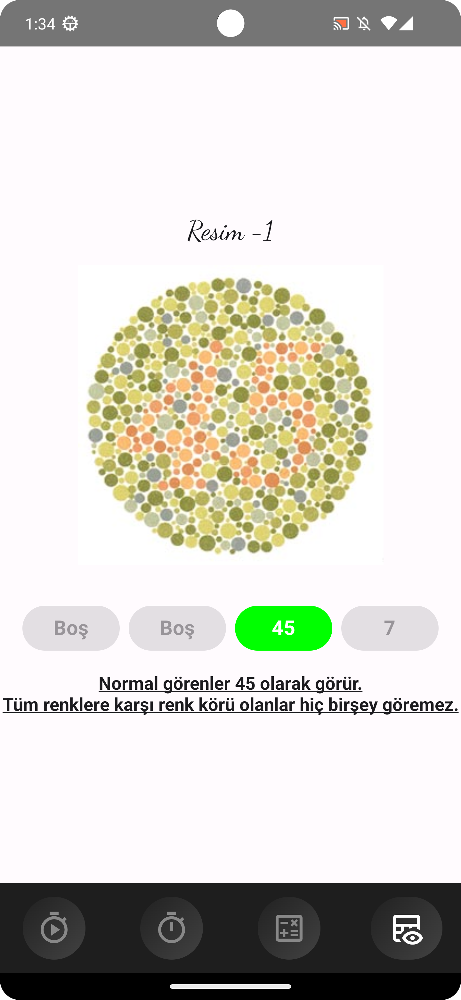
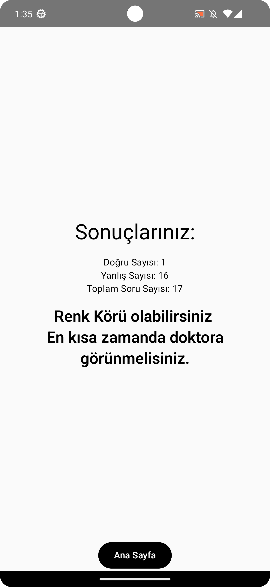

# Pomemetre

Polislik mesleği için sınavlara hazırlık uygulaması.

## Özellikler
- Ekranlar 4 adet:
  1. Kronometre
  2. Alarm & Sayaç
  3. VKE (Vücut Kitle Endeksi) Hesaplama
  4. Renk Körlüğü Testi

- Sesli ikaz uyarıları,
- Kronometre için anlık süre setleme,
- 17 sorudan oluşan renk körlüğü testi,
- Vücut kitle endeksi hesaplama ve karşılaştırma,


## Ekran Görüntüleri

Aşağıda uygulamanın arayüzüne dair bazı ekran görüntüleri bulunmaktadır:

<div style="display: flex; flex-wrap: wrap; gap: 10px;">
  
  

  
  

  
  

  
</div>


## Kurulum
1. Kotlin ve gerekli bağımlılıkları yükleyin.
   ```bash
   ./gradlew build
   ./gradlew run


2. Projeyi yerel ortamınıza kopyalayın:
   ```bash
   git clone https://github.com/1omerozturk/Pomemetre.git
